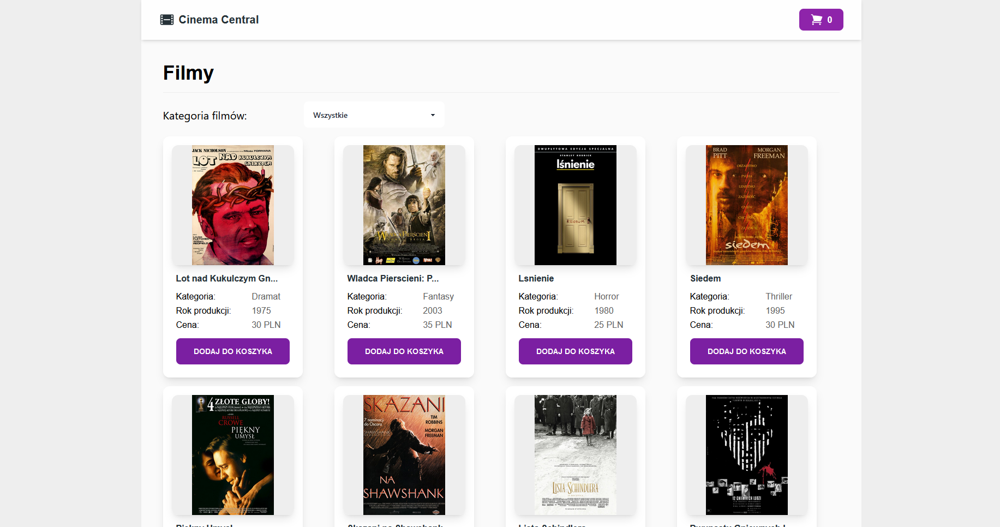
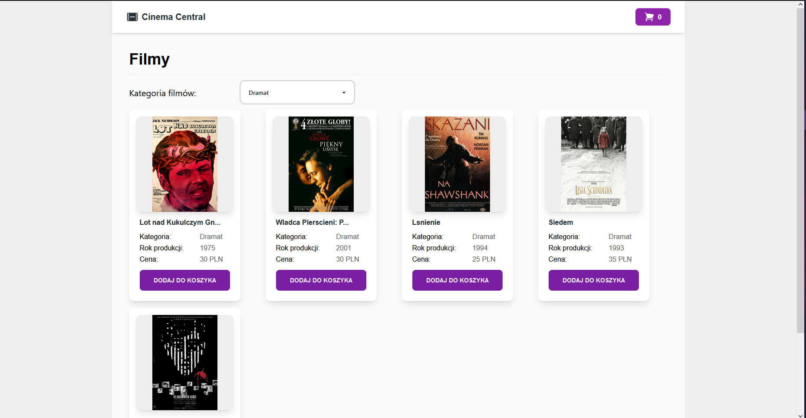
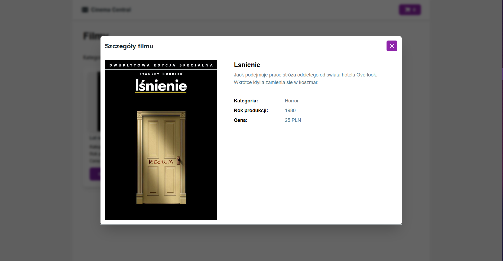
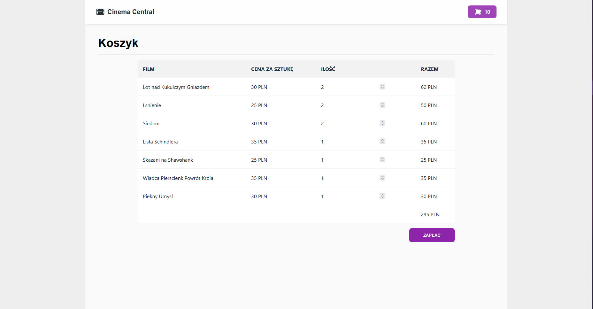
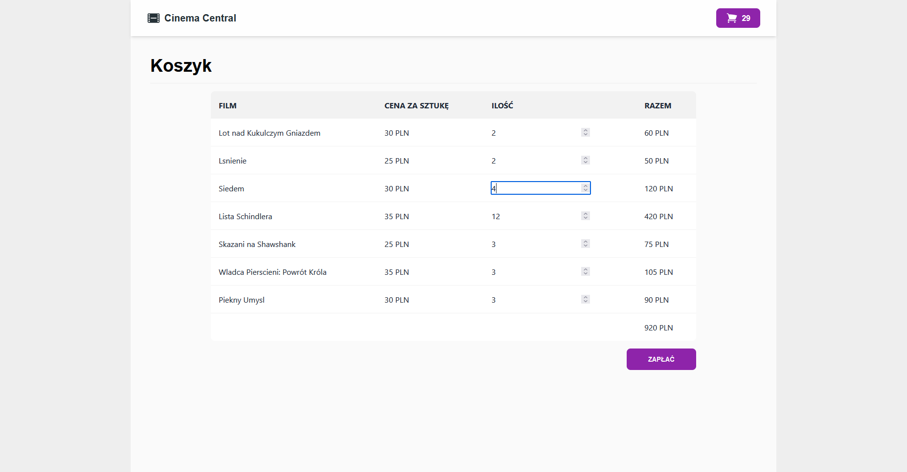

# Movie shop
**Simple online shop which sells movies.** 

Data about movies is stored in sql server database. It's possible to create, read and delete data through API (OpenAPI is already configured). Page displays all movies, allows user to filter by category, add and remove movies from cart (cart is stored in memory).

# Technologies
  
  
  
   

# Content
## Main page

## Filter by category

## Movie details

## Cart

## Udpated Cart

